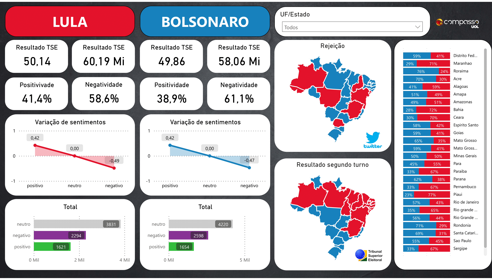
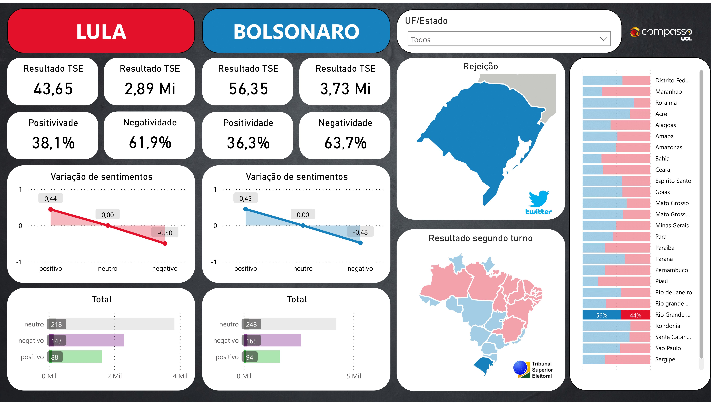
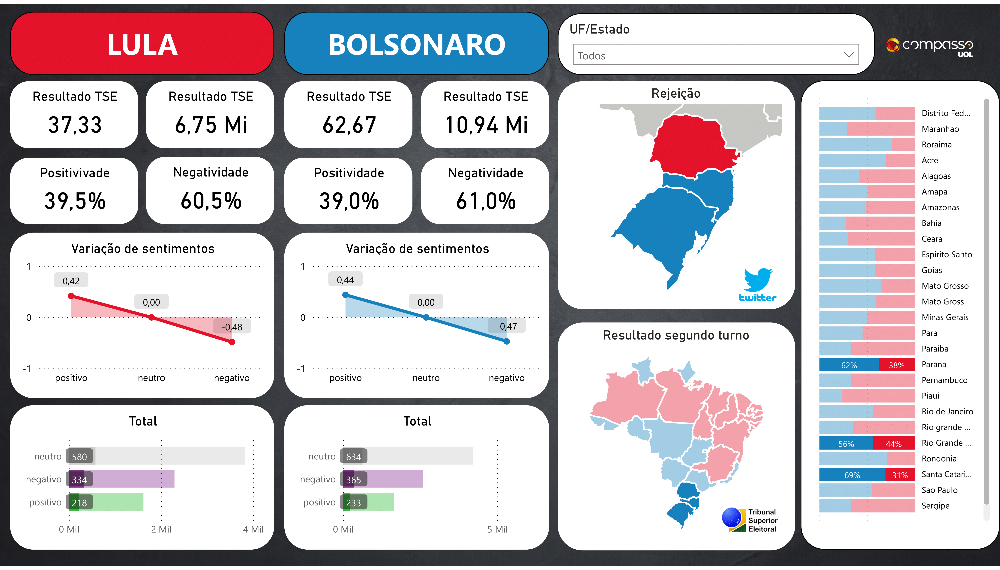

# Sentiment Analysis on Brazilian Presidential Elections 2022

This project aims to analyze the sentiment of tweets related to the two candidates who competed in the second round of the 2022 Brazilian presidential elections. The project uses the Twitter API to fetch tweets, performs sentiment analysis using the VADER algorithm with NLTK, and compares the sentiment scores with the official election results by state.

## Tools Used

-   Python 3.6+
-   Tweepy
-   NLTK
-   Pandas
-   PySpark
-   AWS S3
-   AWS Glue
-   AWS Athena
-   Power BI

## Process

1.  **Data collection**: The Twitter API is used to collect tweets containing specific keywords related to the candidates.
    
2.  **Sentiment analysis**: The tweets are processed with NLTK's VADER algorithm to calculate a sentiment score for each tweet. The tweets are categorized as positive, neutral, or negative sentiment.
    
3.  **Data processing**: The tweets and sentiment scores are processed with Pandas and PySpark to separate the tweets by state.
    
4.  **Official election results**: The official election results by state are obtained from the TSE (Superior Electoral Court) website.
    
5.  **Data storage**: The processed data is stored in a data lake on AWS S3 in the raw layer.
    
6.  **Data transformation**: The data is transformed with AWS Glue to prepare it for querying.
    
7.  **Data querying**: The transformed data is loaded into AWS Athena for querying.
    
8.  **Data visualization**: The data is loaded into Power BI for visualization and comparison with the official election results.
    
## Dash visualization

## Contributing

If you find any issues with the project or want to suggest an improvement, feel free to open an issue or submit a pull request.

